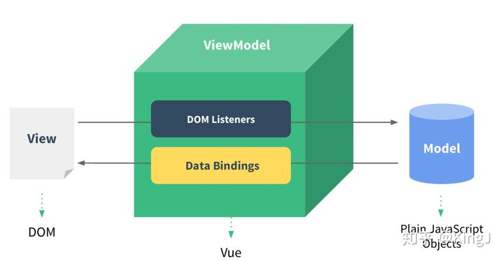
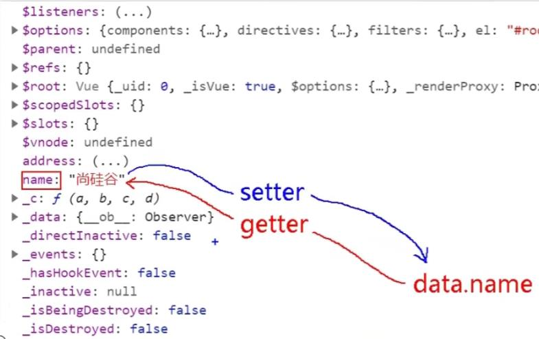
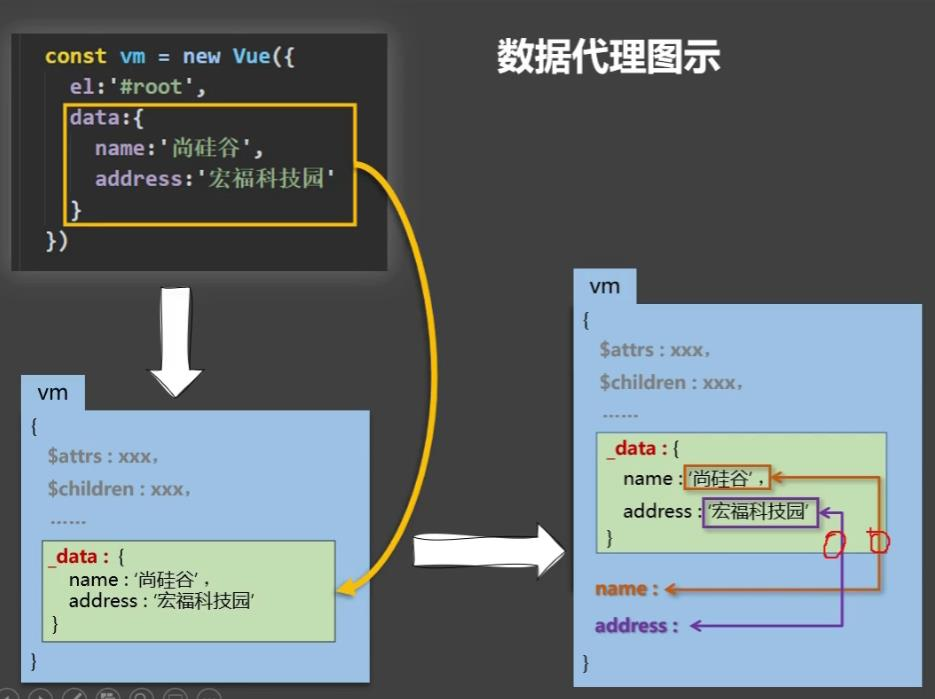
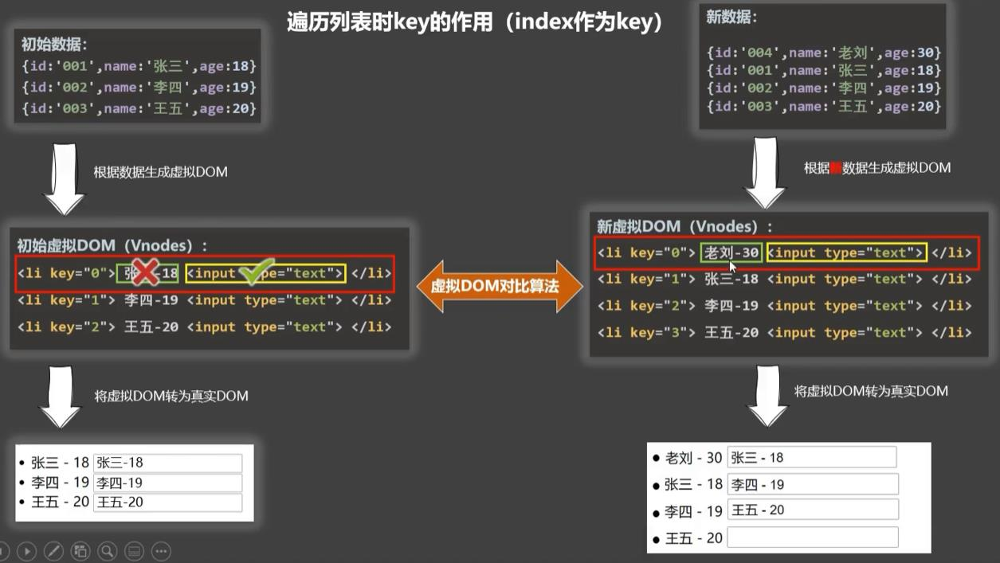
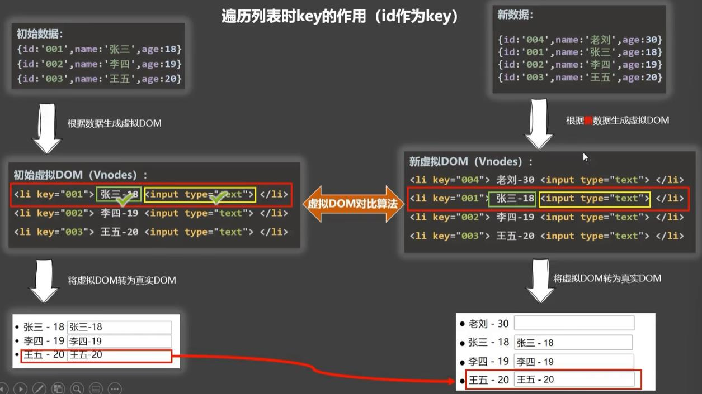

#### vscode live server
右键指定html文件,选择open with live server 
可以开启一个本机服务器,将打开的目录作为服务器root资源  
默认127.0.0.1:5500,会请求一个图标做icon,http://127.0.0.1:5500/favicon.ico:1

#### markdown
1.渲染  
ctrl+shift+k
2.侧边栏渲染：点击右上角的分栏图标

#### vue tips
1.Vue.config.productionTip = false; //阻止vue在启动时生成生产提示
2.el用于指定当前vue实例为哪个容器服务,值通常为css选择器字符串,也可以用document.getElementById("root")这种
3.一个实例不能接管两个容器,会选择找到的第一个,比如class选择器而言
4.不能多个实例接管同一个容器,第一个绑定容器的实例接管,后面的报错无法正常绑定
5.使用了开发版本的vue.js后可以在浏览器的开发者工具里找到vue调试栏,可以修改vue实例的属性值等操作
#### 01-初识vue
``` 
        1.vue工作之前,比如先创建一个vue实例,且要传入一个配置对象
        2.root容器的里代码仍然需要符合html规范,只是混入了一些特殊的vue语法
        3.root容器里的代码称为【vue模板】
        4.vue实例和容器一一对应
        5.真实开发中只有一个vue实例,并且随着组件一起使用
        6.{{xxx}}中的xxx要写js表达式,且xxx可以自动读取到data中的所有属性
        7.一旦data中的数据发生改变,则模板中用到该数据中的地方也会自动更新
        区分js表达式和js代码
            1.表达式：生成一个值,vue插值语句{{}}内部只能防止一个js表达式
                (1)a
                (2)a+b
                (3)demo(1)//函数调用
                (4)x === y ?'a':'b' //三元表达式
            2.js代码(语句)
                1. if(){}
                2. for(){}

``` 
#### 02-vue模板语法
1.插值语法: 
形式：{{xxx}},xxx时js表达式,且可以直接读到data中所有属性
功能：用改变dom节点内容
2.指令语法
例子：v-bind:href="xxx",简写为 :href="xxx",xxx同样是js表达式,且可以直接读到data中所有属性
功能：用于解析标签（包括：标签属性、标签内容、绑定事件）
vue的指令很多,形式都是v-xxx,v-bind是其中之一

#### 03-vue数据绑定
1.单项数据绑定
变量值改变,页面显示改变
v-bind,可以简写为:
2.双向数据绑定
变量值改变,页面显示改变
页面修改数据可以改变变量的值
v-model,一般用于表单类元素,比如input,select等,v-model:value可以简写为v-model
调试例子：
vscode中使用open in live server,然后打开浏览器开发者模式,找到vue调试栏,观察页面+vue实例data属性的变量值,（1）修改变量值观察页面是否变化,（2）修改页面输入值,观察vue实例data属性变量值是否变化

#### 04-vue的data和el的两种写法
1.el的两种写法
(1) new Vue时配置el属性
(2) 先创建vue实例,随后通过vm.$mount("#root")指定el值
2.data的两种写法
(1)对象式
(2)函数式,组件的data必须使用函数式
注意：由vue管理的函数,一定不要写成箭头函数,否则this不再是Vue实例


#### 05-MVVM模式
M:模型(model)：对应data中的数据
V:视图(view)：模板
VM:视图模型(ViewModel):Vue实例对象

data binding:将数据绑定到dom节点上
dom listener:双向数据绑定中,监听dom节点数据变化然后改变vue data属性变量的值
常用vm变量表示vue实例
观察发现:
1.data中所有属性最后都出现在vm(定义的vue实例名字)身上
2.vm上所有属性以及vue原型上所有属性,在vue模板中都可以直接使用
注意：vue模板的两种形式：(1)插值形式(2)指令形式
MVVM是大多数前端框架设计的参考原则

#### 06.1-Object.defineProperty()方法
Object.defineProperty() 方法会直接在一个对象上定义一个新属性,或者修改一个对象的现有属性,并返回此对象。
参考:https://developer.mozilla.org/zh-CN/docs/Web/JavaScript/Reference/Global_Objects/Object/defineProperty
例子:
``` 
const object1 = {};
//(对象,要设置的属性,属性描述符)
// 属性描述符上的value是要设置的属性的值
// 属性描述符的writable值为true时,以后才可以对这个属性进行修改
Object.defineProperty(object1, 'property1', {
  value: 42,
  writable: false
});

object1.property1 = 77;
// throws an error in strict mode

console.log(object1.property1);
// expected output: 42
```

使用Object.defineProperty()给对象新增的属性默认是不可被"枚举"的：
    Object.keys()不会输出新增的属性
    for(var item in person)
属性描述符的属性：
    writable: true, //控制属性是否被修改,默认false
    enumerable:true, //控制属性是否可被枚举,默认false
    enumerable: true //控制属性是否可被删除,默认false
动态设置和调用：
    设置的属性可以设置一个函数,用于读取该属性值时就计算出属性的值
    可以给修改值设置一个触发函数.修改时会调用set()函数
    注意js的普通变量(非对象)的赋值是值传递
    get()、set()函数和属性描述符的writable、enumerable、enumerable不能一起使用

#### 06.2-什么是数据代理
定义：通过一个对象代理对另一个对象中属性的操作（读/写）
```
    let obj = {x:100}
    let obj2 = {y:200}
    Object.defineProperty(obj2,'x',{
        get(){
            return obj.x;
        },
        set(value){
            obj.x = value;
        }
    })
```
#### 06.3-vue数据代理
代码例子:
```
    var vm = new Vue({
        el: "#root",
        data: {
            name: "sangguigu",
            address: "学校"
        }
    });
```
浏览器开发者模式可以console.log(vm)可以看到vm有name和address属性,以name属性为例子来看下vue的数据代理：
vm.name<=>data.name
访问vm.name时->getter->获取data.name
设置vm.name时->setter->设置data.name
验证getter线：console.log(vm.name)发现值是data.name值"sangguigu"
验证getter线: vm.name = "123",发现页面和data.name绑定的dom内容变成了123,检查vm._data.name属性值是否为'123',无vm.data属性

vm.data被vm._data数据劫持了

数据代理的目的就是为了让开发者编码更方便:
vue的模板语法使得"一旦data中的数据发生改变,则模板中用到该数据中的地方也会自动更新",为了实现这一个目的,vue实现了两层关系：第一层,只要vue实例上的对象属性更新了,则{{}}使用属性的地方都更新,第二层,创建vue实例是传递的构造参数对象放到了vm._data对象上,还需要把vm._data对象上的属性映射到vm对象上,这就是数据代理 
没有数据代理的话,就需要{{_data.xxx}}这样就多谢了无用的_data


总结：
vue的数据代理：通过vm对象来操作data对象中的属性(读/写)
vue中数据代理的好处：更加方便的操作data中的数据
基本原理：
通过Object.defineProperty()把data对象上的所有属性添加到vm上,
为每一个添加到vm上的属性,都指定一个getter、setter,在getter、setter内部去操作（读/写）data中对应的属性。
vm._data的getter()也是为了完成对页面的渲染,因为页面dom始终要和数据双向绑定,所以就必须能监听到数据变化.

#### 07.1-vue事件基本使用
1.使用v-on:xxx 或@xxx绑定事件,其中xxx是事件名
2.事件的回调需要配置在methods对象中,最终会在vm上
3.methods中配置的函数,不要用箭头函数！否则this就不是vm了
4.methods中配置的函数,都是被vue管理的函数,this的指向是vm或组件实例对象
5.@click="demo"和@click="demo($event)"效果一致,但后者可以传参
6.绑定vm中参数时默认传参event,形式:@click="method",需要传参数时:@click="method(arg,$event)
#### 07.2-vue事件修饰符
1.prevent:阻止默认事件(常用)
2.stop:阻止事件冒泡(常用),冒泡：内层元素点击事件传播到外层元素,比如div上
3.once:事件只触发一次(常用)
4.capture:使用事件的捕获模式
5.self:只有event.target是当前操作的元素时才触发事件
6.passive:事件的默认形式立即执行,无需等待事件回调执行完毕
7.修饰可以连续写,比如@click.stop.prevent
#### 07.3-vue键盘事件
1.vue常用的按键别名:
回车 enter
删除 delete(捕获"删除"和 退格键)
退出 esc
空格 space
换行 tab(只能绑定keydown,如果绑定keyup,则按下tab,焦点会切到其他地方)
上 up
下 down
左 left
右 right
2.vue未提供别名的按键,可以使用原始key值去绑定,但注意转为kebab-case(短横线命名)
 // event.key按键名字, event.keyCod按键编码
切换大小写按键CapsLock是两个单词,转化为Caps-Lock
3.系统修饰键（用法特殊）：ctrl、alt、shift、meta(windows键)
(1)配合keyup使用：按下修饰键的同时,再安下其他键,随后释放其他键,事件才被触发
(2)配合keydonw使用,正常触发事件
指定两个键联用时才触发,比如ctrl+y才触发： @click.ctrl.y
4.也可以使用keycode去指定具体的按键(不推荐,不同键盘的keycode可能不同)
5.Vue.config.keyCodes.自定义键名 = 键码,可以去定制按键别名
例子:
5.Vue.config.keyCodes.huiche = 13 //定义回车

#### 08.1-vue计算属性
插值表达式,要简单,复杂的插值表达式应该用计算属性代替
1.定义:要用的属性不存在,要通过已有的属性计算得来
2.原理:底层借助Object.defineProperty方法提供的getter和setter
3.get函数什么时候执行?
(1)初次读取时
(2)依赖的数据改变时
4.优势:与methods实现相比,内部有缓存机制(复用),效率更高,调试方便
5.备注:
1.计算属性最终会出现在vm上,直接读取使用即可
2.如果计算属性要被修改,那必须写set函数去响应修改,且set中要引起计算时依赖的数据发生变化

#### 08.2-vue计算属性-简写
如果只需要get不需要修改
```
computed: {
    // 简写
    fullName: function () {
        console.log("get调用了");
        return this.lastName + '-' + this.firstName
    }
```
#### 08.3-vue绑定事件函数可写在调用处
注意:vue的绑定事件的函数被调用时,其函数体可以直接写在调用的地方,其中的变量需要定义在vm实例中,例子如下
```
<button @click="isHot = !isHot">切换天气,click调用函数体直接在调用处</button>
```
如果要使用js的全局变量,加上window,比如window.alert(),例子如下
```
<button @click="window.alert(isHot)">切换天气,click调用函数体直接在调用处</button>
```
#### 09.1-vue监听属性
例子-写法1
```
        watch:{
            isHot:{
                immediate:true, // 初始化时让handler调用一下
                // handler什么时候调用?当isHot发生改变时
                handler(newValue, oldValue){
                    console.log('isHot被修改了');
                }
            }
        }
```
计算属性也可以被监听
例子-写法2
```
    vm.$watch('isHot', {
        immediate: true, // 初始化时让handler调用一下
        // handler什么时候调用?当isHot发生改变时
        handler(newValue, oldValue) {
            console.log('isHot被修改了');
        }
    });
```
1.当监视属性变化时,回调函数自动调用,进行相关操作
2.监视的属性必须存在,才能进行监视
3.监视的两种写法
(1)new Vue时传入watch配置
被监视的属性是字符串,但是可以不加引号
(2)通过vm.$watch监视,被监视的属性是字符串

#### 09.2-vue监听属性-深度监听
深度监视：
(1)Vue中的Watch默认不监测对象内部值得改变(一层).
(2)配置deep:true可以检测对象内部值改变(多层)
备注:
(1)vue自身可以检测对象内部值的改变,但Vue提供的watch默认不可以(效率考虑,深度检测要遍历对象属性,效率比较低)
(2)使用watch时根据数据的具体解构,决定是否采用深度监视

#### 09.3-vue监听属性-简写形式
不需要配置immediate、deep属性时就可以简写
watch简写形式
```
        watch: {
            isHot(newVal, oldVal){
                console.log('isHot被修改了');
            }
        }
```
vm.$watch简写形式
```
    vm.$watch('isHot', function(newValue, oldValue) {
            console.log('isHot被修改了');
        });
```

#### 09.4-vue用监听实现计算属性
计算属性实现: firstName、lastName构成的计算属性
```
    var vm = new Vue({
        el: "#root",
        data: {
            firstName: '三',
            lastName: '张'
        },
        computed: {
            fullName: {
                // get的作用？读取fullName时,get就会被调用,其返回值作为fullName的值
                // get什么时候调用?1.初次读取时2.所依赖的数据发生变化时
                get() {
                    console.log("get调用了");
                    return this.lastName + '-' + this.firstName;
                },
                // set什么时候调用?当fullname被修改时
                // 注意fullname修改并不会引起页面fullname显示处的变化,因为页面计算属性只有当依赖的属性变化才会重新渲染
                // 如果再set方法中修改lastName或firstName就可以引起变化
                set(value) {
                    console.log("set:"+value);
                    const arr = value.split('-');
                    this.lastName=arr[0];
                    this.firstName=arr[1];
                }
            }
        }
    });
```

监听实现：
```
    Vue.config.productionTip = false; //阻止vue在启动时生成生产提示
    var vm = new Vue({
        el: "#root",
        data: {
            firstName: '三',
            lastName: '张',
            fulllName:null
        },
        watch:{
            firstName:{
                immediate: true,
                handler(newVal, oldVal){
                    this.fullName = this.lastName+ '-' + this.firstName;
                }
            },
            lastName:{
                immediate: true,
                handler(newVal, oldVal){
                    this.fullName = this.lastName+ '-' + this.firstName;
                }
            }
        }
    });
```
一般的计算属性需求就用计算属性来实现简单,但是有些情况只能用监听属性实现：

需求:当firstName发生改变时,1s后fullName再改变

```
    Vue.config.productionTip = false; //阻止vue在启动时生成生产提示
    var vm = new Vue({
        el: "#root",
        data: {
            firstName: '三',
            lastName: '张',
            fulllName:null
        },
        watch:{
            firstName:{
                immediate: true,
                handler(newVal, oldVal){
                    // 这里的异步任务要用箭头函数,因为这个函数不是vue管理的函数,如果用普通函数,则this执行全局window
                    setTimeout(()=>{
                        this.fullName = this.lastName+ '-' + this.firstName;
                    },1000);
                    
                }
            },
            lastName:{
                immediate: true,
                handler(newVal, oldVal){
                    setTimeout(()=>{
                        this.fullName = this.lastName+ '-' + this.firstName;
                    },1000);
                }
            }
        }
    });
```
计算属性是靠返回值实现,异步任务无法异步返回
监听不是靠返回值,所以可以异步实现

computd和watch之间的区别:
1.computed能完成的功能,watch都可以完成
2.watch能完成的功能,computed不一定能完成,例如:watch可以进行异步操作
两个重要的小原则:
1.所有被vue管理的函数,要写成普通函数,这样this指向的才是vm或组件实例对象
2.所有不被vue管理的函数(定时器回调,ajax回调函数,promise的回调函数等),写成箭头函数,这样this的回调才是vm或组件实例对象

#### 10.vue绑定样式
##### 1.class
```
//vue部分
        data: {
            mood:'normal',
            arr:['atguigu1','atguigu2','atguigu3'],
            classObj:{
                aiguigu1:false,
                aiguigu2:true,
                aiguigu3:false,
            }
        },
```

###### 字符串写法：
```
// html部分
<div class="basic" :class="mood" @click="changeMood1">绑定class样式--字符串写法</div>

```
###### 数组写法：
```
// html部分
<div class="basic" :class="arr">绑定class样式--数组写法</div>
```
###### 对象写法：
```
// html部分
<div class="basic" :class="classObj">绑定class样式--对象写法</div>
```

##### 2.style
```
// vue部分
            styleObj: {
                fontSize: '40px',
                color: 'red',
            },
            styleObj1: {
                fontSize: '30px',
                color: 'green',
            },
            styleObj2: {
                backgroundColor: 'gray'
            },
```

###### 数组写法：
```
// html部分
        <div class="basic" :style="[styleObj1, styleObj2]">绑定style,数组写法</div>

```

###### 对象写法：
```
// html部分
 <div class="basic" :style="styleObj">绑定style,对象写法</div>

```

【Tip】
不变的css部分可以直接用class写死,变化的用vue的:class绑定变量,按照：只有class名字变化、class数量也变化,class有预定义但是要选择显示来使用 "字符串、数组、对象"显示

【注意】
不能在data中的一个元素中引用其他元素,只能在methods、computed、watch中引用,或者直接在调用处引用
错误示例:
```
        data: {
            styleObj1: {
                fontSize: '30px',
                color: 'green',
            },
            styleObj2: {
                backgroundColor: 'gray'
            },
            styleArr:[ this.styleObj1, this.styleObj2] // 此处写法错误
            styleArr:[
                styleObj1: {
                    fontSize: '30px',
                    color: 'green',
                },
                styleObj2: {
                    backgroundColor: 'gray'
                }
            ]
        },
```
正确示例
```
<div class="basic" :style="[styleObj1, styleObj2]">绑定style,数组写法</div>
```


#### 11.vue条件渲染
为了将一组html标签进行条件选择
1.可以用一个div包裹起来,但是这样破坏了原有的结构
2.用template来包裹起来,只能配合v-if使用,不能和v-show使用,渲染的时候template会扔掉

#### 11.2 vue v-for
1.用于展示列表数据
2.语法: v-for="(item,value) in xxx", :key=yyy"
3.可遍历: 数组、对象、字符串(用得很少)、指定次数(用得很少)

#### 11.3 vue key原理
vue渲染原理：
vue data->虚拟 dom->真实dom
用户的输入都是真实dom
dom diff算法:
vue的dom diff只在虚拟dom中进行,根据key,对相同key的dom进行diff比较,不一样的部分就重新渲染成真实dom,一样的部分就复用真实dom(一个相同key中可能有多个dom),新key的dom直接重新渲染



所以使用index作为key时，新增元素时,不用使用已经使用的index,最好数据对应唯一的key

面试题:react,vue中的key的作用?
1.虚拟dom key的作用:
key时虚拟dom对象的标识,当数据发生变化时,Vue会根据【新数据】生成新的虚拟dom,
随后vue进行【新虚拟DOM】与【旧虚拟DOM】的差异比较
2.对比规则
(1)旧虚拟dom中找到了与新虚拟DOM相同的key
旧虚拟dom中内容没变,直接使用之前的真实dom
虚拟dom中内容变了,则生成新的真实dom,随后替换掉页面中之前的真实dom
(2)旧虚拟dom中未找到与新虚拟dom相同的key
创建新的真实dom,随后渲染到页面
3.用index作为key可能会引发的问题
    1.若对数据逆序添加、逆序删除等破坏顺序操作：会产生没有必要的真实dom更新==>界面效果没问题,但是效率低
    2.如果结构中还包含输入类的dom:会产生错误dom更新==>界面有问题
4.开发中如何选择key?
1.最好使用每条数据唯一标识作为key,比如id、手机号、身份证号、学号等唯一值
2.如果不存在对数据逆序添加、逆序删除等破坏顺序问题，仅用于渲染列表展示,可以使用index作为key

#### 11.4 vue 列表过滤